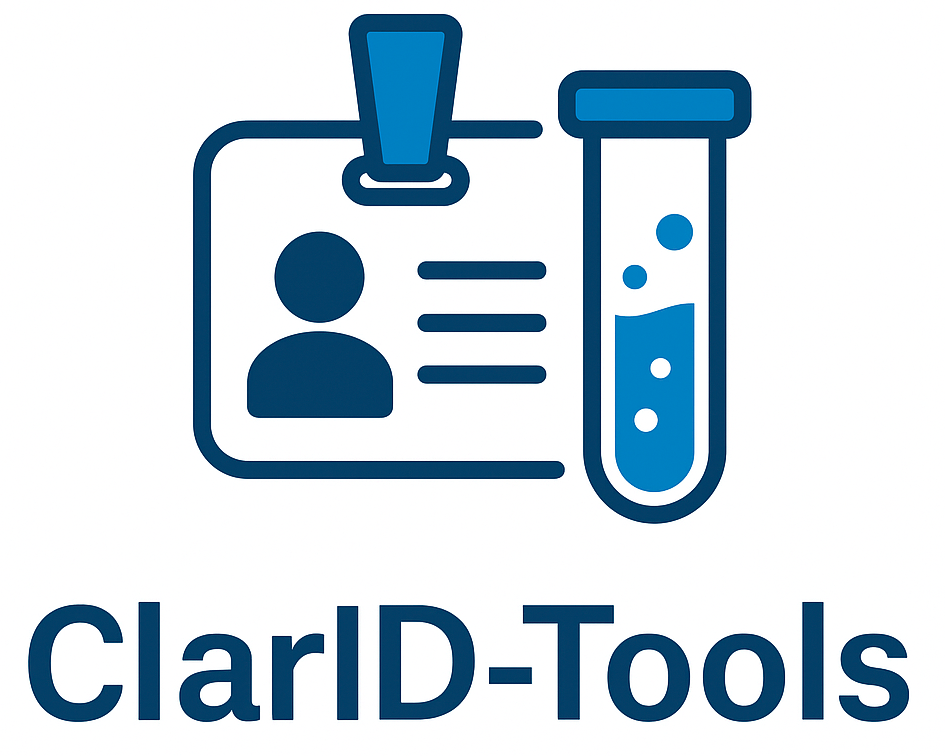

  

    <em>ClarID: A Human-Readable and Compact Identifier Specification for Biomedical Metadata Integration</em>

---

**📘 Documentation:** <a href="https://cnag-biomedical-informatics.github.io/clarid-tools" target="_blank">https://cnag-biomedical-informatics.github.io/clarid-tools</a>

**📓 Google Colab tutorial:** 

**🗂️  Use Cases I & II GDC Data:** <a href="https://github.com/CNAG-Biomedical-Informatics/clarid-tools/tree/main/nb/data" target="_blank">https://github.com/CNAG-Biomedical-Informatics/clarid-tools/tree/main/nb/data</a>

**📦 CPAN Distribution:** <a href="https://metacpan.org/pod/ClarID::Tools" target="_blank">https://metacpan.org/pod/ClarID::Tools</a>

**🐳 Docker Hub Image:** <a href="https://hub.docker.com/r/manuelrueda/clarid-tools/tags" target="_blank">https://hub.docker.com/r/manuelrueda/clarid-tools/tags</a>

---

# ClarID-Tools

<!--description-start-->

## 📝 Description

**ClarID-Tools** is a toolkit for working with the **ClarID** specification, including the reference command-line implementation, preprocessing utilities, and example workflows. The objective is to standardize how subject and biosample metadata are transformed into compact, informative IDs for downstream integration, tracking, and exchange.

---

## 🔬 Key Features

- 🧬 **Biosample and Subject ID generation** from structured metadata
- 🩺 **Support for clinical and experimental metadata**, including species, tissue, assay, condition, and more
- 📄 **Human-readable and stub-formatted modes** for compact or verbose identifiers
- 🧪 **Bulk and single-record encoding/decoding**
- ✅ **Schema validation** using JSON Schema and YAML codebooks
- 📦 Command-line interface 

---

<!--description-end-->

## 🚀 Getting Started

### 🛠️  Installation

We offer two modes of installation:

1. [Non-Containerized](non-containerized/README.md)

2. [Containerized](docker/README.md)

### 📘 Example Usage

1. [Quickstart](https://cnag-biomedical-informatics.github.io/clarid-tools/usage/quickstart/)

2. Use Cases:
 
  * [Biosample](https://cnag-biomedical-informatics.github.io/clarid-tools/use-cases/biosample/)
  * [Subject](https://cnag-biomedical-informatics.github.io/clarid-tools/use-cases/subject/)

---

## 🧠 Citation

If you use **ClarID-Tools** in your work, please cite:

Manuel Rueda and Ivo G. Gut (2025). ClarID: A Human-Readable and Compact Identifier Specification for Biomedical Metadata Integration. _Journal of Biomedical Semantics_. Accepted.

---

## 👤 Author 

Written by Manuel Rueda, PhD. Info about CNAG can be found at [https://www.cnag.eu](https://www.cnag.eu).

---

## 📄 License

ClarID-Tools is released under the Artistic License. See the [LICENSE](LICENSE) file for details.
