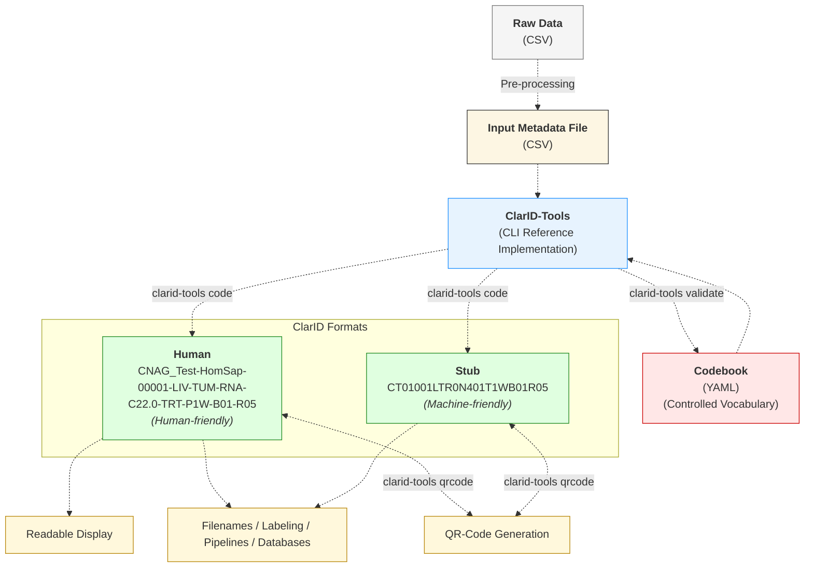

# Implementation Details

## Flowchart

## Architecture

- **Language & framework:** Perl 5, `Moo` and `MooX::Options`.  
- **Parsing / validation:** `YAML::XS`, `Text::CSV_XS`, `JSON::Validator` (codebook validated by JSON Schema).  
- **QR codes:** `qrencode` (Linux).  
- **Config:** YAML codebook (controlled vocabulary + optional aliases).

---

## Design choices (short)

- Full externalization of the identifier spec into JSON Schema was tried but became complex (nested regexes and transforms).  
- **Hybrid approach:** core structural rules are implemented in code for clarity; domain vocabularies (species, tissues, assays, aliases) live in the YAML codebook and are schema-validated.  
- This keeps parsing deterministic and easier to maintain while retaining configurability.

---

## Encoding / decoding

### `project` / `study`
- Labels like `TCGA_AML` remain literal unless an **alias** is declared in the YAML codebook. Add aliases when you need short representations.

### `subject_id` — Base62, fixed width
- Numeric `subject_id` → Base62 (`0-9A-Za-z`) with **fixed width** (default: 3) to simplify parsing.
- Options:
  - `--subject_id_pad_length` — numeric padding for human format (if used).
  - `--subject_id_base62_width` — width for stub Base62 field.
- Example: `subject_id = 999` → Base62 `G7` → padded to `0G7`.
- Capacity: `62^width - 1` unique IDs.

### `condition` (disease)
- ICD-10 codes → internal numeric index → Base62 (fixed length, default 3).
- Human form: multiple conditions separated by `+`.  
- Stub form: condition codes concatenated (no separator); decoding uses reverse mapping.

### `species`
- `stub_code` declared in the YAML codebook as a 2-character code (Base62 alphabet).  
- One code (e.g., `00`) reserved for unknown.  
- Optional `tax_code` is kept for traceability (not used in stubs).

### `tissue`, `sample_type`, `assay`
- Use **predefined stub_codes** from the codebook (recommended 2–5 chars).  
- Decoding strategy: parse fixed-width fields first, then greedy reverse lookup on remaining stub codes sorted by descending length to avoid prefix collisions (e.g., `PB`, `T`, `HI` parse `PBTHI` correctly).

---

## Extensibility & pragmatic workarounds

- Targets `subject` and `biosample` entities; extensible to cohorts, datasets, experiments with minor code changes.  
- Temporary workaround: repurpose unused codebook fields (e.g., use `tissue` for geographic location). This keeps identifiers functional if overall structure is preserved.

---

## Implementation notes & tips

- Keep stub codes short (2–5 chars) and unique to avoid parsing ambiguity. ✅  
- Increase `--subject_id_base62_width` before cohort size exceeds `62^width - 1`.  
- Use YAML codebook aliases for stable short labels.  
- Maintain the JSON Schema when editing the codebook.

---
