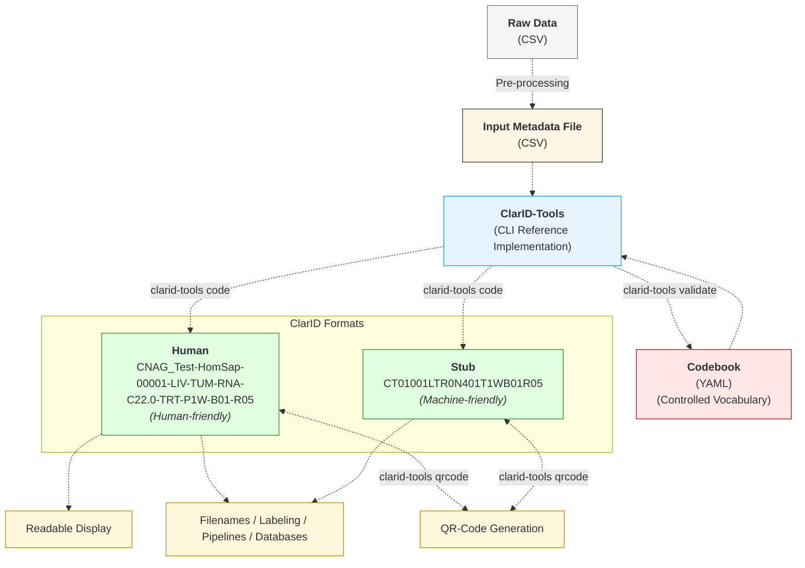

# Implementation Details

!!! info "Reference implementation"
    ClarID-Tools is the reference command-line implementation of the ClarID specification described in the accompanying paper.

This page describes how the reference implementation turns structured metadata plus a validated codebook into human-readable and stub-format identifiers.

## Flowchart

```mermaid
flowchart TD
  subgraph Z["ClarID Formats"]
    direction TB
    D1["<strong>Human</strong><br>CNAG_Test-HomSap-00001-LIV-TUM-RNA-C22.0-TRT-P1W-B01-R05<br><i>(Human-friendly)</i>"]
    D2["<strong>Stub</strong><br>CT01001LTR0N401T1WB01R05<br><i>(Machine-friendly)</i>"]
  end

  R["<strong>Raw Data</strong><br>(CSV)"] -. "Pre-processing" .-> A["<strong>Input Metadata File</strong><br>(CSV)"]
  A -.-> B["<strong>ClarID-Tools</strong><br>(CLI Reference Implementation)"]
  B -. "clarid-tools validate" .-> C["<strong>Codebook</strong><br>(YAML)<br>(Controlled Vocabulary)"]
  C -.-> B

  B -. "clarid-tools code" .-> D1
  B -. "clarid-tools code" .-> D2

  D1 -.-> E["Readable Display"] & F["Filenames / Labeling / Pipelines / Databases"]
  D1 <-. "clarid-tools qrcode" .-> G["QR-Code Generation"]
  D2 -.-> F 
  D2 <-. "clarid-tools qrcode" .-> G

  style R  fill:#f5f5f5,stroke:#777,stroke-width:1px
  style A  fill:#fdf6e3,stroke:#333,stroke-width:1px
  style B  fill:#e7f3fe,stroke:#1e90ff,stroke-width:1px
  style C  fill:#ffe7e7,stroke:#cc0000,stroke-width:1px
  style D1 fill:#e0ffe0,stroke:#228b22,stroke-width:1px
  style D2 fill:#e0ffe0,stroke:#228b22,stroke-width:1px
  style E  fill:#fff8dc,stroke:#b8860b,stroke-width:1px
  style F  fill:#fff8dc,stroke:#b8860b,stroke-width:1px
  style G  fill:#fff8dc,stroke:#b8860b,stroke-width:1px
```

## Workflow Summary

1. Prepare an input table containing normalized metadata fields.
2. Validate the codebook structure against the JSON Schema.
3. Encode metadata into `human` or `stub` identifiers with `clarid-tools code`.
4. Decode identifiers back to structured fields when needed.
5. Optionally generate QR codes from the resulting IDs.

In short, the paper defines the identifier model, while ClarID-Tools implements the operational workflow around that model.

## Architecture

This architecture describes the reference CLI implementation used to encode, decode, validate, and generate QR codes for ClarID identifiers.

- **Language & framework:** Perl 5, `Moo` and `MooX::Options`. Perl was chosen for efficiency in handling structured text files and for simplicity in a reference CLI implementation.  
- **Parsing / validation:** `YAML::XS`, `Text::CSV_XS`, `JSON::Validator` (codebook validated by JSON Schema).  
- **QR codes:** `qrencode` (Linux).  
- **Config:** YAML codebook (controlled vocabulary + optional aliases).

The implementation is modular and intentionally straightforward, with a test suite that helps keep behavior reproducible. Equivalent implementations in other programming languages can preserve interoperability by following the same structural rules and YAML-based configuration model.

!!! note "Reimplementation in other languages"
    ClarID-Tools is designed so that equivalent implementations in other programming languages can preserve interoperability by following the same identifier rules and YAML-based configuration model.

    If you are planning a reimplementation or language binding, please use the [repository issues page](https://github.com/CNAG-Biomedical-Informatics/clarid-tools/issues).

---

## Design choices (short)

- Full externalization of the identifier spec into JSON Schema was tried but became complex (nested regexes and transforms).  
- **Hybrid approach:** core structural rules are implemented in code for clarity; domain vocabularies (species, tissues, assays, aliases) live in the YAML codebook and are schema-validated.  
- This keeps parsing deterministic and easier to maintain while retaining configurability.

## Normative vs operational details

- The identifier semantics are described in the ClarID paper and in the [Specification](specification.md).
- The CLI flags, file formats, and examples in this repository are operational details of the reference implementation.
- The YAML codebook is the main extension point for adapting ClarID-Tools to local vocabularies without changing the identifier model itself.

---

## Encoding / decoding

The `human` and `stub` formats are fully interoperable but serve different purposes: the human-readable form emphasizes interpretability, whereas the stub form emphasizes compactness for computational workflows.

### `project` / `study`
- Labels like `TCGA_AML` remain literal unless an **alias** is declared in the YAML codebook. Add aliases when you need short representations.

### `subject_id` — Base62, fixed width
- Numeric `subject_id` → Base62 (`0-9A-Za-z`) with **fixed width** (default: 3) to simplify parsing.
- Options:
  - `--subject_id_pad_length` — decimal padding width for `subject_id` in human format.
  - `--subject_id_base62_width` — width of the Base62 `subject_id` field in stub format.
- Example: `subject_id = 999` → Base62 `G7` → padded to `0G7`.
- Capacity: `62^width - 1` unique IDs.

!!! note "Human-readable versus stub appearance"
    Stub fields are compact encodings of the same metadata, not visual abbreviations of the human-readable identifier. In particular, `species` uses a static codebook `stub_code`, while `subject_id` is converted from the numeric subject identifier into Base62.

### `condition` (disease)
- ICD-10 codes → internal numeric index → Base62 (fixed length, default 3).
- The numeric mapping is derived from the packaged ICD-10 order map distributed with ClarID-Tools (`icd10_order.json`).
- Human form: multiple conditions separated by `+`.  
- Stub form: condition codes concatenated (no separator); decoding uses reverse mapping.

!!! warning "Condition ordering and versioning"
    Stub `condition` values depend on the ICD-10 ordering distributed with the reference implementation. In practice, encoded values should be interpreted together with the ClarID-Tools release and associated resources used for encoding. Keep the codebook and packaged mapping files under version control. Future revisions may revisit this mapping strategy if broader interoperability needs emerge.

### `species`
- `stub_code` declared in the YAML codebook as a 2-character code (Base62 alphabet).  
- One code (e.g., `00`) reserved for unknown.  
- Optional `tax_code` is kept for traceability (not used in stubs).

!!! note "Species capacity"
    The current stub design supports up to 3,844 species codes with a 2-character Base62 space. This is typically sufficient for biomedical metadata integration. If your project exceeds that range, use the human-readable format or adopt an extended stub specification for your deployment.

### `tissue`, `sample_type`, `assay`
- Use **predefined stub_codes** from the codebook (recommended 2–5 chars).  
- Decoding strategy: parse fixed-width fields first, then greedy reverse lookup on remaining stub codes sorted by descending length to avoid prefix collisions (e.g., `PB`, `T`, `HI` parse `PBTHI` correctly).

---

## Extensibility & pragmatic workarounds

- Targets `subject` and `biosample` entities; extensible to cohorts, datasets, experiments with minor code changes.  
- Temporary workaround: repurpose unused codebook fields (e.g., use `tissue` for geographic location). This keeps identifiers functional if overall structure is preserved.

---

## Implementation notes & tips

- Keep stub codes short (2–5 chars) and unique to avoid parsing ambiguity. ✅  
- Increase `--subject_id_base62_width` before cohort size exceeds `62^width - 1`.  
- Use YAML codebook aliases for stable short labels.  
- Maintain the JSON Schema when editing the codebook.
- Re-run encode/decode examples after changing the codebook so documentation examples stay in sync with the current release.

---
