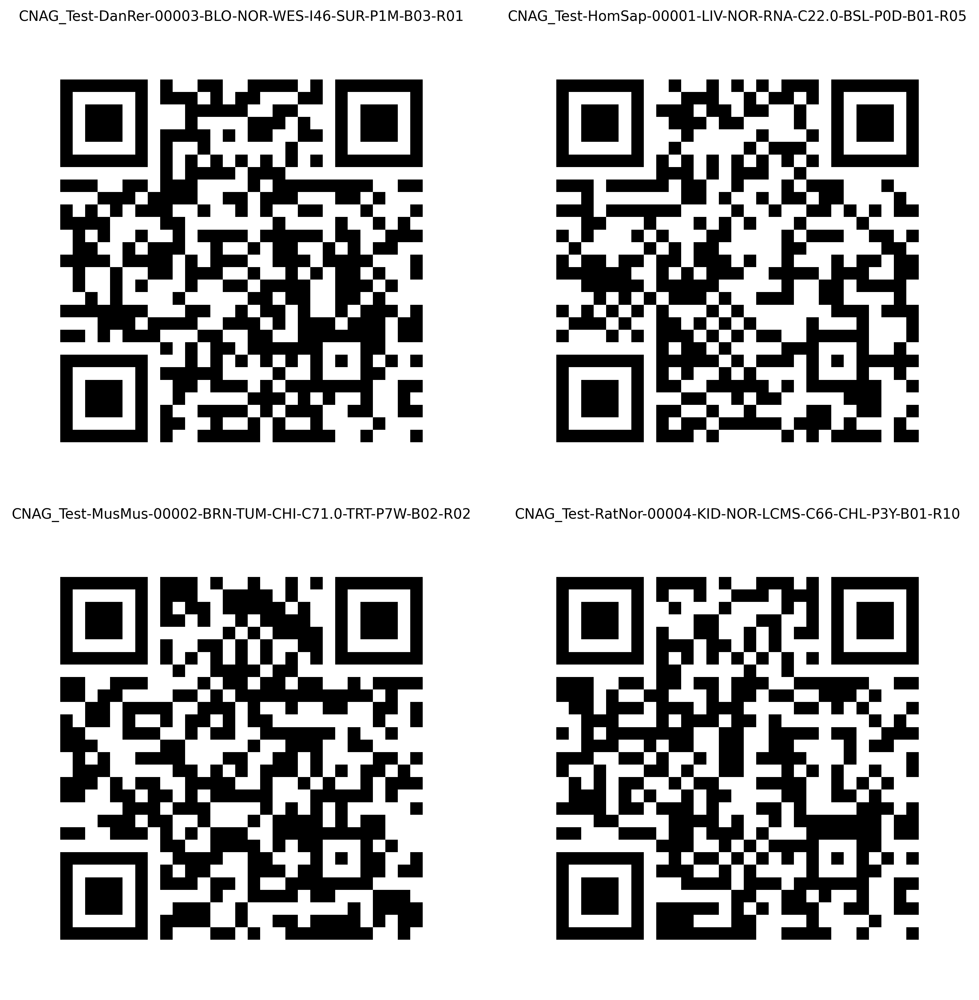
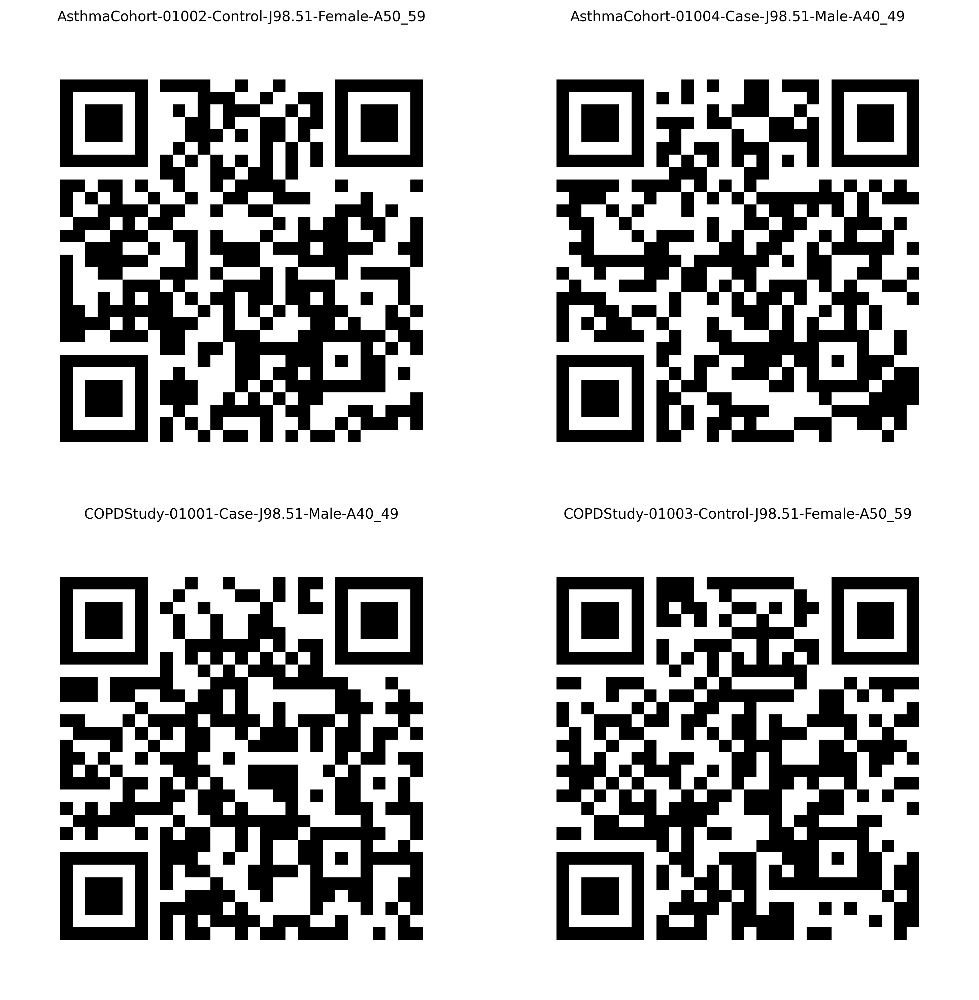

Let's start encoding and decoding right away!

=== "`code` mode" 

    ## Biosample
    
    ### Human Format
    
    ```bash
    # Encode one biosample with the CLI
    bin/clarid-tools code \
      --entity biosample \
      --format human \
      --action encode \
      --codebook share/clarid-codebook.yaml \
      --project TCGA-AML \
      --species Human \
      --subject_id 42 \
      --tissue Liver \
      --sample_type Tumor \
      --assay RNA_seq \
      --condition C15.3 \
      --timepoint Treatment \
      --duration P1M \
      --batch 1 \
      --replicate 5
    ```
    
    ??? Example "Expected output:"
    
        ```
        TCGA_AML-HomSap-00042-LIV-TUM-RNA-C15.3-TRT-P1M-B01-R05
        ```
    
    ```bash
    # Decode one biosample with the CLI
    bin/clarid-tools code \
      --entity biosample \
      --format human \
      --action decode \
      --codebook share/clarid-codebook.yaml \
      --clar_id TCGA_AML-HomSap-00042-LIV-TUM-RNA-C15.3-TRT-P1M-B01-R05
    ```
    
    ??? Example "Expected output:"
    
        ```
        project: TCGA-AML
        species: Human
        subject_id: 42
        tissue: Liver
        sample_type: Tumor
        assay: RNA_seq
        condition: C15.3
        timepoint: Treatment
        duration: P1M
        batch: 1
        replicate: 5
        ```
    
    ```bash
    # Decode one biosample with the CLI + translating condition
    bin/clarid-tools code \
      --entity biosample \
      --format human \
      --action decode \
      --codebook share/clarid-codebook.yaml \
      --clar_id TCGA_AML-HomSap-00042-LIV-TUM-RNA-C15.3-TRT-P1M-B01-R05 \
      --with_condition_name
    ```
    
    ??? Example "Expected output:"
    
        ```
        project: TCGA-AML
        species: Human
        subject_id: 42
        tissue: Liver
        sample_type: Tumor
        assay: RNA_seq
        condition: C15.3
        timepoint: Treatment
        duration: P1M
        batch: 1
        replicate: 5
        condition_name: Malignant neoplasm of upper third of esophagus
    
        ```
    
    ```bash
    # Bulk encode from CSV
    bin/clarid-tools code \
      --entity biosample \
      --format human \
      --action encode \
      --codebook share/clarid-codebook.yaml \
      --infile ex/biosample.csv \
      --sep ","
    ```
    
    ??? Example "Expected output:"
    
        ```
        unique_id,subject_id,project,species,tissue,sample_type,assay,condition,timepoint,duration,batch,replicate,clar_id
        samp001,1,TCGA-AML,Human,Liver,Normal,RNA_seq,Z77.22,Baseline,P1D,1,5,TCGA_AML-HomSap-00001-LIV-NOR-RNA-Z77.22-BSL-P1D-B01-R05
        samp002,2,TCGA-AML,Mouse,Brain,Tumor,ChIP_seq,Z77.22,Treatment,P7W,2,2,TCGA_AML-MusMus-00002-BRN-TUM-CHI-Z77.22-TRT-P7W-B02-R02
        samp003,3,TCGA-AML,Zebrafish,Blood,Normal,WES,Z77.22,Surgery,P1Y,3,1,TCGA_AML-DanRer-00003-BLO-NOR-WES-Z77.22-SUR-P1Y-B03-R01
        samp004,4,TCGA-AML,Rat,Kidney,Normal,LC_MS,Z77.22,Challenge,P3M,1,32,TCGA_AML-RatNor-00004-KID-NOR-LCMS-Z77.22-CHL-P3M-B01-R32
        ```
    
    ```bash
    # Bulk decode from CSV
    bin/clarid-tools code \
      --entity biosample \
      --format human \
      --action decode \
      --codebook share/clarid-codebook.yaml \
      --infile ex/biosample_to_decode.csv \
      --sep ","
    ```
    
    ??? Example "Expected output:"
    
        ```
        unique_id,clar_id,project,species,subject_id,tissue,sample_type,assay,condition,timepoint,duration,batch,replicate
        samp001,TCGA_AML-HomSap-00001-LIV-NOR-RNA-A01.01-BSL-P0D-B01-R05,TCGA-AML,Human,1,Liver,Normal,RNA_seq,A01.01,Baseline,P0D,1,5
        samp002,TCGA_AML-MusMus-00002-BRN-TUM-CHI-A01.02-TRT-P7D-B02-R02,TCGA-AML,Mouse,2,Brain,Tumor,ChIP_seq,A01.02,Treatment,P7D,2,2
        samp003,TCGA_AML-DanRer-00003-BLO-NOR-WES-A01.03-SUR-P2W-B03-R01,TCGA-AML,Zebrafish,3,Blood,Normal,WES,A01.03,Surgery,P2W,3,1
        samp004,TCGA_AML-RatNor-00004-KID-NOR-LCMS-A01.04-CHL-P2M-B01-R03,TCGA-AML,Rat,4,Kidney,Normal,LC_MS,A01.04,Challenge,P2M,1,3
        ```
    
    ---
    
    #### Stub Format
    
    ```bash
    # Encode one biosample with the CLI 
    bin/clarid-tools code \
      --entity biosample \
      --format stub \
      --action encode \
      --codebook share/clarid-codebook.yaml \
      --project TCGA-AML \
      --species Human \
      --subject_id 42 \
      --tissue Liver \
      --sample_type Tumor \
      --assay RNA_seq \
      --condition C15.3 \
      --timepoint Treatment \
      --duration P1M \
      --batch 1 \ 
      --replicate 5
    ```
    
    ??? Example "Expected output:"
    
        ```
        AML0100gLTR0MP01T1MB01R05
        ```
    
    ```bash
    # Decode one biosample with the CLI
    bin/clarid-tools code \
      --entity biosample \
      --format stub \
      --action decode \
      --codebook share/clarid-codebook.yaml \
      --stub_id AML0100gLTR0MP01T1MB01R05
    ```
    
    ??? Example "Expected output:"
    
        ```bash
        project: TCGA-AML
        species: Human
        subject_id: 42
        tissue: Liver
        sample_type: Tumor
        assay: RNA_seq
        condition: C15.3
        timepoint: Treatment
        duration: P1M
        batch: 1
        replicate: 5
        ```
    ---
    ## Subject
    
    ### Human Format
    
    ```
    # Bulk encode
    bin/clarid-tools code \
      --entity subject \
      --format human \
      --action encode \ 
      --codebook share/clarid-codebook.yaml \
      --infile ex/subject.csv \
       --sep ","
    ```
    
    ??? Example "Expected output:"
    
        ```bash
        unique_id,study,subject_id,type,condition,sex,age_group,clar_id
        patient_001,COPDStudy,1001,Case,J98.51,Male,Age40to49,COPDStudy-01001-Case-J98.51-Male-A40_49
        patient_002,AsthmaCohort,1002,Control,J98.51,Female,Age50to59,AsthmaCohort-01002-Control-J98.51-Female-A50_59
        patient_003,COPDStudy,1003,Control,J98.51,Female,Age50to59,COPDStudy-01003-Control-J98.51-Female-A50_59
        patient_004,AsthmaCohort,1004,Case,J98.51,Male,Age40to49,AsthmaCohort-01004-Case-J98.51-Male-A40_49
        ```
    
    ```
    # Bulk decode
    bin/clarid-tools code \
      --entity subject \
      --format human \
      --action decode \
      --codebook share/clarid-codebook.yaml \
      --infile ex/subject_to_decode_human.csv \
      --sep ","
    ```
    
    ??? Example "Expected output:"
        ```bash
        patient_001,COPDStudy-01001-Case-J98.51-Male-A40_49,COPDStudy0G9C2d1MA4,COPDStudy,1001,Case,J98.51,Male,Age40to49
        patient_002,AsthmaCohort-01002-Control-J98.51-Female-A50_59,AsthmaCohort0GAN2d1FA5,AsthmaCohort,1002,Control,J98.51,Female,Age50to59
        patient_003,COPDStudy-01003-Control-J98.51-Female-A50_59,COPDStudy0GBN2d1FA5,COPDStudy,1003,Control,J98.51,Female,Age50to59
        patient_004,AsthmaCohort-01004-Case-J98.51-Male-A40_49,AsthmaCohort0GCC2d1MA4,AsthmaCohort,1004,Case,J98.51,Male,Age40to49
        ```
    
    ### Stub Format
    
    ```
    # Bulk encode
    bin/clarid-tools code \
      --entity subject \
      --format stub \
      --action encode \
      --codebook share/clarid-codebook.yaml \
      --infile ex/subject.csv \
      --sep ","
    ```
    
    ??? Example "Expected output:"
    
        ```bash
        unique_id,study,subject_id,type,condition,sex,age_group,stub_id
        patient_001,COPDStudy,1001,Case,J44.9,Male,Age40to49,COPDStudy0G9C3Of01MA4
        patient_002,AsthmaCohort,1002,Control,J98.51,Female,Age50to59,AsthmaCohort0GAN3SM01FA5
        patient_003,COPDStudy,1003,Control,J44.9,Female,Age50to59,COPDStudy0GBN3Of01FA5
        patient_004,AsthmaCohort,1004,Case,J98.51,Male,Age40to49,AsthmaCohort0GCC3SM01MA4
        ```

    !!! Hint "Log file creation"
        You can create a log file by adding the flag:

        ```bash
        --log            # creates clarid-cli.log in the current directory
        --log myfile.log # writes to a specific file
        ```
    
=== "`qrcode` mode"
    
    First we will create a directory to write the PNGs (default is `qrcodes/`):

    ```bash
    mkdir qrcodes_dir
    ```

    ## Biosample

    Now we convert all `clarid_id` records in `ex/biosample_to_decode.csv`:

    ```bash
    # Bulk encode to QR
    bin/clarid-tools qrcode \--action encode \
      --input ex/biosample_to_decode.csv \
      --outdir qrcodes_dir \
      --size 10
    ```

    ??? Warning "Filename sanitization"
        When encoding values into QR code PNGs, the script sanitizes each value to create a safe filename. By default, any character that is not a letter, number, underscore, or dash is replaced with an underscore (_). This includes dots (.), spaces, and other special characters.
     
    ??? Example "See QR-codes"
         

     Convert back to ClarID:

     ```bash
     # Bulk decode from QR
     bin/clarid-tools qrcode \
       --action decode \
       --input qrcodes_dir \
       --outfile file.csv \
       --column clar_id
     ```

    ## Subject


    ```bash
    # Bulk encode to QR
    bin/clarid-tools qrcode \--action encode \
      --input ex/subject_to_decode_human.csv \
      --outdir qrcodes_dir \
      --size 10
    ```

    ??? Example "See QR-codes"
            


=== "`validate` mode"

    This subcommand serves to validate a user's created **codebook**.


     ```bash
     # Validate codebook
     bin/clarid-tools validate \
       --codebook share/clarid-codebook.yaml
     ```

